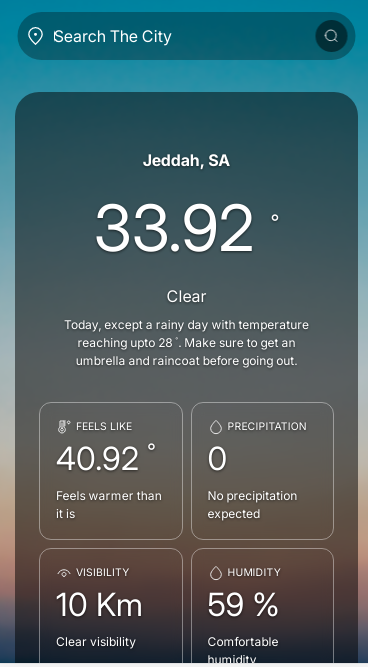

# Weather App (Week 2)

A responsive weather application built with vanilla HTML5, CSS3, and JavaScript. Demonstrates core front-end fundamentals with a focus on CSS Grid layout architecture and real-time API integration.

---

## Technologies Used

- **HTML5** – semantic markup
- **CSS3** – Grid layout system (two-panel responsive design), Flexbox, custom properties
- **JavaScript (vanilla)** – async/await, DOM manipulation, event handling
- **Weather API** – real-time weather data (OpenWeatherMap or similar)
- **Fetch API** – asynchronous HTTP requests

---

## Features

- 🌡️ **Real-time weather data** – Search by city and display current conditions
- 📱 **Responsive two-panel layout** – CSS Grid with adaptive column proportions (desktop/mobile)
- 🎨 **Dynamic weather icons** – Visual indicators based on current conditions
- 📊 **Extended forecast** – Display multi-day predictions (if applicable)
- ⚡ **Fast API integration** – Fetch and render weather data with async/await
- 🌍 **Location-based search** – Manual city input with real-time validation
- 🎯 **Clean, readable UI** – Focussed information hierarchy

---

## Project Structure

```
weather-app/
├── index.html          # Semantic HTML structure
├── style.css           # CSS Grid + responsive breakpoints
├── script.js           # Weather data fetching, DOM manipulation
├── assets/
│   └── icons/          # Weather condition SVGs/images
└── README.md
```

---

## Setup & Usage

### Clone the Repository

```bash
git clone https://github.com/qayoommunawar/weather-app.git
cd weather-app
```

### Running Locally

1. **Using Live Server (VS Code)**
   - Install the [Live Server extension](https://marketplace.visualstudio.com/items?itemName=ritwickdey.LiveServer)
   - Right-click `index.html` and select "Open with Live Server"
   - App will open in your browser at `http://localhost:5500`

2. **Using Python (simple HTTP server)**
   ```bash
   # Python 3.x
   python -m http.server 8000
   ```
   Then navigate to `http://localhost:8000`

### API Setup

1. Sign up for a free API key at [OpenWeatherMap](https://openweathermap.org/api)
2. Add your API key to `script.js`:
   ```javascript
   const API_KEY = 'your-api-key-here';
   ```
3. The app will now fetch live weather data

---

## Learning Outcomes

### Key Concepts Tackled

- **CSS Grid** – Two-column layout with proportional sizing (e.g., `grid-template-columns: 2fr 1fr`)
  - Responsive behaviour across breakpoints
  - Aligning items within grid cells
  - Media query adjustments for mobile (stacked layout)

- **Asynchronous JavaScript** – Fetch API with error handling
  - async/await syntax for cleaner code flow
  - Handling network failures gracefully

- **DOM Manipulation** – Dynamically rendering API responses
  - Template literals for readable HTML injection
  - Event listeners for user input (search, location changes)

- **Responsive Design** – Mobile-first approach with breakpoints
  - Touch-friendly input fields and buttons
  - Flexible typography and spacing

### Challenges Overcome

- Grid column proportions during mobile transitions (switched from fixed widths to flexible ratios)
- API latency causing UI blocking (resolved with async/await + loading states)
- Icon rendering across different weather conditions (standardised SVG approach)

### What's Next

- [ ] Geolocation API for automatic location detection
- [ ] Save favourite cities to localStorage
- [ ] Animated weather transitions (CSS keyframes)
- [ ] Hourly forecast expansion
- [ ] Dark mode toggle with CSS custom properties

---

## Screenshots / Demo


---

## Notes

This project is part of a structured learning roadmap to solidify vanilla JavaScript and responsive design fundamentals before moving into frameworks like React.

Feedback welcome. Direct any issues to the repo or reach out.

---

## Author

Abdul Qayoom | Front-end Developer, Lahore  
[GitHub](https://github.com/qayoommunawar)